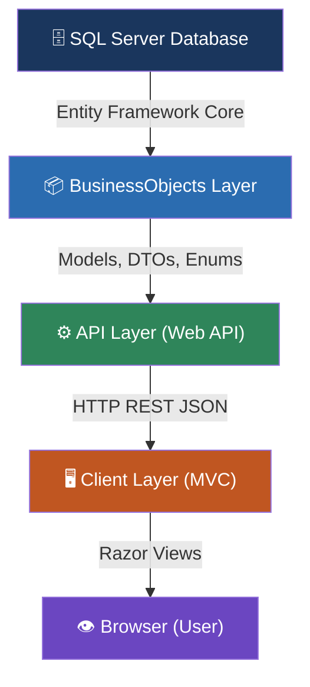
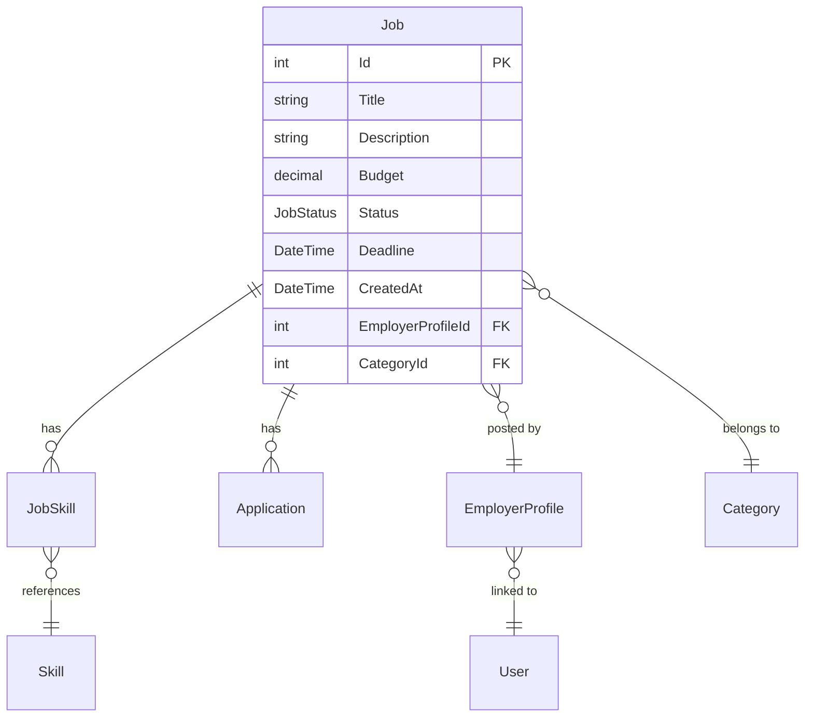
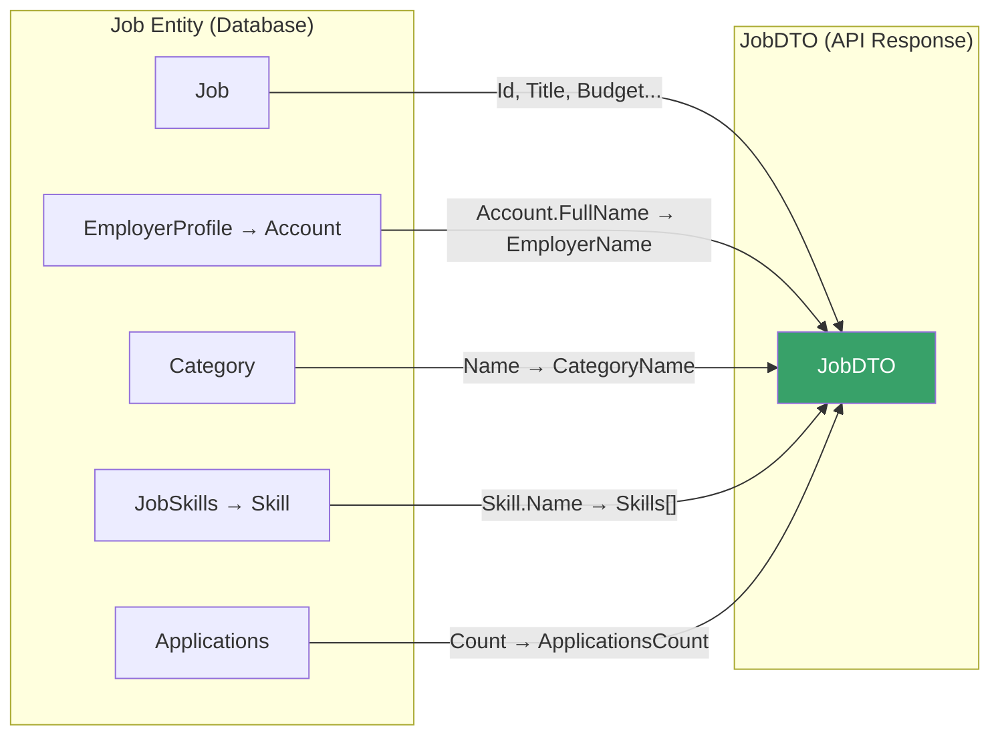
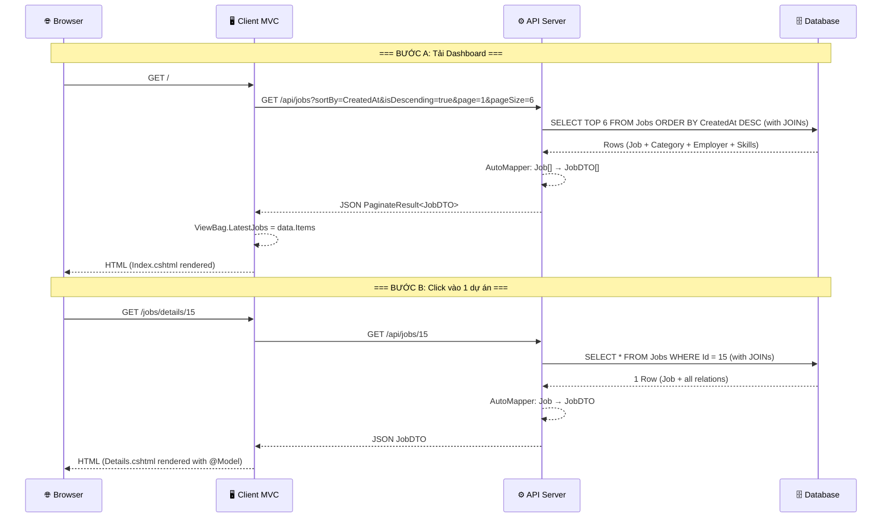
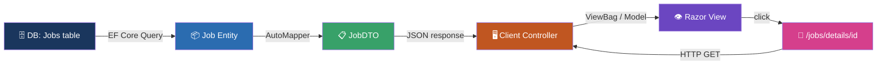

# Luồng Dữ Liệu Job: Từ Database → Dashboard → Job Detail

## Tổng Quan Kiến Trúc

Hệ thống sử dụng kiến trúc **3 tầng (3-tier architecture)** với **ASP.NET Core MVC** cho cả API và Client:



---

## Bước 1: Database Model — Định nghĩa bảng `Jobs`

### 📄 [Job.cs](file:///d:/Duong/Desktop/SWP391/Freelance-Job-Matching-System/BusinessObjects/Models/Job.cs)

Entity `Job` ánh xạ trực tiếp tới bảng `Jobs` trong SQL Server thông qua Entity Framework Core:

```csharp
public class Job
{
    [Key]
    public int Id { get; set; }                    // Khóa chính, tự tăng

    [Required]
    [StringLength(255)]
    public string Title { get; set; }              // Tiêu đề dự án

    public string Description { get; set; }         // Mô tả chi tiết
    public decimal Budget { get; set; }             // Ngân sách (VNĐ)
    public JobStatus Status { get; set; }           // Trạng thái: ACTIVE, DELETED...
    public DateTime? Deadline { get; set; }         // Hạn nộp
    public DateTime CreatedAt { get; set; }         // Ngày tạo

    // Foreign Keys + Navigation Properties
    public int EmployerProfileId { get; set; }
    public int CategoryId { get; set; }

    [ForeignKey(nameof(EmployerProfileId))]
    public EmployerProfile EmployerProfile { get; set; }  // Nhà tuyển dụng

    [ForeignKey(nameof(CategoryId))]
    public Category Category { get; set; }                // Danh mục

    public ICollection<Application> Applications { get; set; }  // Danh sách ứng tuyển
    public ICollection<JobSkill> JobSkills { get; set; }        // Kỹ năng yêu cầu
}
```

### Quan hệ giữa các bảng:



### 📄 [AppDbContext.cs](file:///d:/Duong/Desktop/SWP391/Freelance-Job-Matching-System/BusinessObjects/AppDbContext.cs)

DbContext đăng ký `DbSet<Job>` để EF Core biết cách truy vấn:

```csharp
public class AppDbContext : DbContext
{
    public DbSet<Job> Jobs { get; set; }           // ← Bảng Jobs
    public DbSet<JobSkill> JobSkills { get; set; } // ← Bảng trung gian Job-Skill
    public DbSet<Category> Categories { get; set; }
    public DbSet<Application> Applications { get; set; }
    // ... các DbSet khác

    protected override void OnModelCreating(ModelBuilder modelBuilder)
    {
        // Cấu hình precision cho cột Budget
        modelBuilder.Entity<Job>()
            .Property(j => j.Budget)
            .HasPrecision(18, 2);

        // Cấu hình composite key cho JobSkill
        modelBuilder.Entity<JobSkill>()
            .HasKey(js => new { js.JobId, js.SkillId });
    }
}
```

---

## Bước 2: DTO — Chuyển đổi dữ liệu để trả về Client

### 📄 [JobDTO.cs](file:///d:/Duong/Desktop/SWP391/Freelance-Job-Matching-System/BusinessObjects/DTOs/JobDTO.cs)

DTO (Data Transfer Object) là lớp trung gian, chỉ chứa những field cần thiết để gửi cho Client — **không gửi trực tiếp Entity** để tránh lộ cấu trúc DB và circular reference:

```csharp
public class JobDTO
{
    public int Id { get; set; }
    public string Title { get; set; }
    public string? Description { get; set; }
    public decimal Budget { get; set; }
    public JobStatus Status { get; set; }
    public DateTime? Deadline { get; set; }
    public DateTime CreatedAt { get; set; }
    public int EmployerProfileId { get; set; }
    public string EmployerName { get; set; }       // ← Flatten từ EmployerProfile.Account.FullName
    public int CategoryId { get; set; }
    public string CategoryName { get; set; }       // ← Flatten từ Category.Name
    public int ApplicationsCount { get; set; }     // ← Đếm từ Applications.Count
    public List<string> Skills { get; set; }       // ← Flatten từ JobSkills → Skill.Name
}
```

> [!IMPORTANT]
> `EmployerName`, `CategoryName`, `ApplicationsCount`, `Skills` — **không tồn tại trong bảng Job**. Chúng được **flatten** từ các bảng liên quan nhờ **AutoMapper**.

---

## Bước 3: AutoMapper — Ánh xạ `Job` → `JobDTO`

### 📄 [MappingProfile.cs](file:///d:/Duong/Desktop/SWP391/Freelance-Job-Matching-System/BusinessObjects/Mapping/MappingProfile.cs)

AutoMapper tự động chuyển `Job` entity thành `JobDTO`:

```csharp
CreateMap<Job, JobDTO>()
    // Lấy tên Category
    .ForMember(d => d.CategoryName,
        o => o.MapFrom(s => s.Category != null ? s.Category.Name : ""))

    // Lấy tên Employer (ưu tiên Account.FullName, fallback CompanyName)
    .ForMember(d => d.EmployerName,
        o => o.MapFrom(s =>
            s.EmployerProfile != null && s.EmployerProfile.Account != null
                ? s.EmployerProfile.Account.FullName
                : (s.EmployerProfile != null ? s.EmployerProfile.CompanyName : "")))

    // Đếm số lượt ứng tuyển
    .ForMember(d => d.ApplicationsCount,
        o => o.MapFrom(s => s.Applications.Count))

    // Lấy danh sách tên Skill
    .ForMember(d => d.Skills,
        o => o.MapFrom(s =>
            s.JobSkills != null
                ? s.JobSkills.Select(x => x.Skill != null ? x.Skill.Name : "").ToList()
                : new List<string>()));
```



---

## Bước 4: API Controller — Endpoint trả dữ liệu Job

### 📄 [JobsController.cs (API)](file:///d:/Duong/Desktop/SWP391/Freelance-Job-Matching-System/API/Controllers/JobsController.cs)

### 4.1 — GET `/api/jobs` — Lấy danh sách Job (có phân trang + filter)

Đây là endpoint mà **Dashboard gọi** để lấy "Dự án mới nhất":

```csharp
[HttpGet]
public async Task<IActionResult> GetJobs([FromQuery] FilterJobDTO filter)
{
    // ① Xây query từ DbContext, Include các bảng liên quan
    var query = _context.Jobs
        .Include(x => x.Category)
        .Include(x => x.EmployerProfile)
            .ThenInclude(x => x.Account)
        .AsQueryable();

    // ② Áp dụng phân quyền (Admin thấy tất cả, Freelancer chỉ thấy ACTIVE...)
    query = ApplyPermission(query);

    // ③ Áp dụng các filter (keyword, category, budget, skill...)
    if (!string.IsNullOrWhiteSpace(filter.Keyword))
        query = query.Where(x => x.Title.Contains(filter.Keyword) || ...);
    // ... nhiều filter khác

    // ④ Sắp xếp (mặc định theo CreatedAt giảm dần = mới nhất trước)
    query = filter.SortBy?.ToLower() switch
    {
        "title"    => query.OrderByDescending(x => x.Title),
        "budget"   => query.OrderByDescending(x => x.Budget),
        _          => query.OrderByDescending(x => x.CreatedAt)  // ← Default
    };

    // ⑤ Phân trang
    var totalItems = await query.CountAsync();
    var items = await query
        .Skip((filter.Page - 1) * filter.PageSize)
        .Take(filter.PageSize)
        .ProjectTo<JobDTO>(_mapper.ConfigurationProvider)  // ← AutoMapper chuyển Job → JobDTO
        .ToListAsync();

    // ⑥ Trả về kết quả phân trang
    return Ok(new PaginateResult<JobDTO>
    {
        Items = items,           // Danh sách JobDTO
        TotalItems = totalItems, // Tổng số job
        PageNumber = filter.Page,
        PageSize = filter.PageSize
    });
}
```

> [!NOTE]
> `ProjectTo<JobDTO>()` sử dụng AutoMapper tại **tầng SQL query**, nghĩa là EF Core chỉ SELECT những cột cần thiết — hiệu quả hơn nhiều so với `_mapper.Map<>()` sau khi load toàn bộ entity.

### 4.2 — GET `/api/jobs/{id}` — Lấy chi tiết 1 Job

Đây là endpoint mà **trang Job Detail gọi** khi user click vào 1 dự án cụ thể:

```csharp
[HttpGet("{id:int}")]
public async Task<IActionResult> GetJob(int id)
{
    var query = _context.Jobs
        .Include(x => x.Category)
        .Include(x => x.EmployerProfile)
            .ThenInclude(x => x.Account)
        .Include(x => x.JobSkills)          // ← Load thêm Skills
            .ThenInclude(x => x.Skill)
        .Include(x => x.Applications)       // ← Load thêm Applications
        .AsQueryable();

    query = ApplyPermission(query);

    var job = await query.FirstOrDefaultAsync(x => x.Id == id);

    if (job == null) return NotFound();

    return Ok(_mapper.Map<JobDTO>(job));    // ← Trả 1 JobDTO object
}
```

### JSON Response mẫu:

```json
// GET /api/jobs?page=1&pageSize=6&sortBy=CreatedAt&isDescending=true
{
  "items": [
    {
      "id": 15,
      "title": "Thiết kế Logo công ty ABC",
      "description": "Cần thiết kế logo chuyên nghiệp...",
      "budget": 5000000,
      "status": 0,
      "deadline": "2026-07-01T00:00:00",
      "createdAt": "2026-06-15T10:30:00",
      "employerProfileId": 3,
      "employerName": "Nguyễn Văn A",
      "categoryId": 2,
      "categoryName": "Thiết kế đồ họa",
      "applicationsCount": 7,
      "skills": ["Photoshop", "Illustrator", "Figma"]
    }
    // ... thêm 5 job khác
  ],
  "totalItems": 42,
  "pageNumber": 1,
  "pageSize": 6
}
```

---

## Bước 5: Client Controller — Gọi API và truyền dữ liệu vào View

### 📄 [BaseController.cs (Client)](file:///d:/Duong/Desktop/SWP391/Freelance-Job-Matching-System/Client/Controllers/BaseController.cs)

Mọi Client Controller đều kế thừa `BaseController`, cung cấp helper method `GetAsync<T>()`:

```csharp
public class BaseController : Controller
{
    protected async Task<T> GetAsync<T>(string endpoint)
    {
        var client = _factory.CreateClient("API");  // ← HttpClient trỏ tới API server

        // Tự động đính kèm JWT token từ cookie
        var token = Request.Cookies["Auth.JWT"];
        if (!string.IsNullOrWhiteSpace(token))
            client.DefaultRequestHeaders.Authorization =
                new AuthenticationHeaderValue("Bearer", token);

        var response = await client.GetAsync(endpoint);
        return await response.Content.ReadFromJsonAsync<T>();  // ← Deserialize JSON → C# object
    }
}
```

### 📄 [HomeController.cs](file:///d:/Duong/Desktop/SWP391/Freelance-Job-Matching-System/Client/Controllers/HomeController.cs) — Trang Dashboard

```csharp
public class HomeController : BaseController
{
    public async Task<IActionResult> Index()
    {
        // ① Xây query string: lấy 6 dự án mới nhất
        var queryParams = new Dictionary<string, string?>
        {
            ["sortBy"] = "CreatedAt",
            ["isDescending"] = "true",
            ["page"] = "1",
            ["pageSize"] = "6"           // ← Chỉ lấy 6 job cho Dashboard
        };
        var url = QueryHelpers.AddQueryString("api/jobs", queryParams);
        // → url = "api/jobs?sortBy=CreatedAt&isDescending=true&page=1&pageSize=6"

        // ② Gọi API, deserialize JSON → PaginateResult<JobDTO>
        var data = await GetAsync<PaginateResult<JobDTO>>(url);

        // ③ Truyền dữ liệu vào View qua ViewBag
        ViewBag.LatestJobs = data?.Items ?? new List<JobDTO>();

        return View();  // → render Views/Home/Index.cshtml
    }
}
```

### 📄 [JobsController.cs (Client)](file:///d:/Duong/Desktop/SWP391/Freelance-Job-Matching-System/Client/Controllers/JobsController.cs) — Trang Job Detail

```csharp
[Route("jobs")]
public class JobsController : BaseController
{
    // GET /jobs/details/15
    [HttpGet("details/{id:int}")]
    [AllowAnonymous]
    public async Task<IActionResult> Details(int id)
    {
        // ① Gọi API lấy chi tiết 1 job theo ID
        var job = await GetAsync<JobDTO>($"api/jobs/{id}");
        //                                ↑ API endpoint: GET /api/jobs/15

        if (job == null) return NotFound();

        // ② Trả View với Model = JobDTO
        return View(job);  // → render Views/Jobs/Details.cshtml
    }
}
```



---

## Bước 6: Dashboard View — Hiển thị "Dự Án Mới Nhất"

### 📄 [Index.cshtml (Home)](file:///d:/Duong/Desktop/SWP391/Freelance-Job-Matching-System/Client/Views/Home/Index.cshtml#L162-L237)

Section **"Dự Án Mới Nhất"** nằm tại dòng 162-237 trong file:

```html
<!-- ========== PROJECTS (dynamic from API) ========== -->
<section class="fv-jobs fv-section-alt" id="projects">
    <div class="fv-wrap">
        <!-- Tiêu đề section -->
        <div class="fv-section-head">
            <div>
                <h2>Dự Án Mới Nhất</h2>
                <p>Cập nhật liên tục — hàng trăm dự án mới mỗi ngày</p>
            </div>
            <a href="/jobs" class="fv-see-all">Xem tất cả →</a>
        </div>
```

**Đọc dữ liệu từ ViewBag:**

```csharp
@{
    // ① Ép kiểu ViewBag.LatestJobs → List<JobDTO>
    var latestJobs = ViewBag.LatestJobs as List<JobDTO> ?? new List<JobDTO>();
}
```

**Render từng Job Card bằng vòng lặp `foreach`:**

```html
@if (latestJobs.Any())
{
    <div class="fv-job-grid">
        @foreach (var job in latestJobs)
        {
            <!-- ② Tính "thời gian trước" -->
            @{
                var diff = DateTime.Now - job.CreatedAt;
                var timeAgo = diff.TotalHours < 24
                    ? $"{(int)diff.TotalHours} giờ trước"
                    : $"{(int)diff.TotalDays} ngày trước";
            }

            <!-- ③ Mỗi card là 1 thẻ <a> link tới /jobs/details/{id} -->
            <a href="/jobs/details/@job.Id" class="fv-job-card">

                <!-- Header: Logo + Title + Company -->
                <div class="fv-job-header">
                    <div class="fv-job-logo"><i class="bi bi-briefcase"></i></div>
                    <div>
                        <div class="fv-job-title">@job.Title</div>           <!-- ← Từ JobDTO.Title -->
                        <div class="fv-job-company">@job.EmployerName</div>  <!-- ← Từ JobDTO.EmployerName -->
                    </div>
                </div>

                <!-- Mô tả rút gọn (120 ký tự) -->
                <p class="fv-job-desc">
                    @(job.Description?.Length > 120
                        ? job.Description.Substring(0, 120) + "..."
                        : job.Description)
                </p>

                <!-- Footer: Skills Tags + Budget -->
                <div class="fv-job-footer">
                    <div class="fv-job-tags">
                        @foreach (var skill in job.Skills.Take(3))  <!-- ← Chỉ hiển thị 3 skill -->
                        {
                            <span class="fv-job-tag">@skill</span>
                        }
                    </div>
                    <span class="fv-job-budget">@job.Budget.ToString("N0") VNĐ</span>
                </div>

                <!-- Meta: Thời gian + Số ứng tuyển -->
                <div class="fv-job-meta">
                    <span><i class="bi bi-clock"></i> @timeAgo</span>
                    <span>@job.ApplicationsCount ứng tuyển</span>
                </div>
            </a>
        }
    </div>
}
```

> [!TIP]
> Khi click vào card, thẻ `<a href="/jobs/details/@job.Id">` sẽ điều hướng browser tới URL `/jobs/details/15` (ví dụ) — trùng với route `[HttpGet("details/{id:int}")]` trong **Client JobsController**.

---

## Bước 7: Job Detail View — Hiển thị chi tiết khi bấm vào dự án

### 📄 [Details.cshtml](file:///d:/Duong/Desktop/SWP391/Freelance-Job-Matching-System/Client/Views/Jobs/Details.cshtml)

View này nhận `@model BusinessObjects.DTOs.JobDTO` — dữ liệu truyền từ `return View(job)` ở Controller:

```html
@model BusinessObjects.DTOs.JobDTO  <!-- ← Nhận JobDTO object làm Model -->

<!-- ① HEADER: Tiêu đề + Meta -->
<div class="jd-header">
    <h1 class="jd-title">@Model.Title</h1>
    <div class="jd-subtitle">
        <span class="jd-badge-cat">@Model.CategoryName</span>
        <span>Ngày đăng: @Model.CreatedAt.ToString("dd/MM/yyyy HH:mm")</span>
        <span>Lượt ứng tuyển: <strong>@Model.ApplicationsCount</strong></span>
    </div>
</div>

<!-- ② LAYOUT: 2 cột (7:5) -->
<div class="jd-main-layout">

    <!-- CỘT TRÁI: Hình ảnh + Mô tả -->
    <div class="jd-left-col">
        
        <div class="jd-desc-text">@Model.Description</div>  <!-- ← Full description -->
    </div>

    <!-- CỘT PHẢI: Thông tin chi tiết -->
    <div class="jd-right-col">
        <!-- Box 1: Thông tin dự án -->
        <ul class="jd-info-list">
            <li>ID dự án: #@Model.Id</li>
            <li>Ngày đăng: @Model.CreatedAt.ToString("dd/MM/yyyy")</li>
            <li>Hạn nộp: @(Model.Deadline?.ToString("dd/MM/yyyy") ?? "Không thời hạn")</li>
            <li>Ngân sách: @Model.Budget.ToString("N0") VNĐ</li>
            <li>
                Kỹ năng:
                @foreach (var skill in Model.Skills)
                {
                    <span class="jd-skill-badge">@skill</span>
                }
            </li>
        </ul>

        <!-- Box 2: Thông tin nhà tuyển dụng -->
        <div class="jd-employer-name">@Model.EmployerName</div>

        <!-- ③ NÚT ỨNG TUYỂN: Phân theo role -->
        @if (CurrentUser.IsGuest)
        {
            <!-- Guest → Mở modal đăng nhập -->
            <button data-bs-toggle="modal" data-bs-target="#loginPromptModal">
                Ứng tuyển dự án này
            </button>
        }
        else if (CurrentUser.Role == "FREELANCER")
        {
            <!-- Freelancer → Mở modal nhập Cover Letter -->
            <button data-bs-toggle="modal" data-bs-target="#applyJobModal">
                Ứng tuyển dự án này
            </button>
        }
        else
        {
            <!-- Employer/Admin → Disabled -->
            <button disabled>Chỉ dành cho Freelancer</button>
        }
    </div>
</div>

<!-- ④ MODAL ỨNG TUYỂN: POST /jobs/apply/{id} -->
<form asp-action="Apply" asp-route-id="@Model.Id" method="post">
    <textarea name="coverLetter" placeholder="Mô tả kinh nghiệm..."></textarea>
    <button type="submit">Gửi đơn ứng tuyển</button>
</form>
```

---

## Tóm Tắt Toàn Bộ Luồng

| # | Layer | File | Vai trò |
|---|-------|------|---------|
| 1 | **Database Model** | [Job.cs](file:///d:/Duong/Desktop/SWP391/Freelance-Job-Matching-System/BusinessObjects/Models/Job.cs) | Định nghĩa bảng Jobs + quan hệ với Category, Employer, Skills, Applications |
| 2 | **DbContext** | [AppDbContext.cs](file:///d:/Duong/Desktop/SWP391/Freelance-Job-Matching-System/BusinessObjects/AppDbContext.cs) | Đăng ký `DbSet<Job>`, cấu hình quan hệ bảng |
| 3 | **DTO** | [JobDTO.cs](file:///d:/Duong/Desktop/SWP391/Freelance-Job-Matching-System/BusinessObjects/DTOs/JobDTO.cs) | Flatten dữ liệu: gom EmployerName, CategoryName, Skills, ApplicationsCount |
| 4 | **AutoMapper** | [MappingProfile.cs](file:///d:/Duong/Desktop/SWP391/Freelance-Job-Matching-System/BusinessObjects/Mapping/MappingProfile.cs) | Tự động chuyển `Job` → `JobDTO` với các custom mapping |
| 5 | **API Controller** | [JobsController.cs (API)](file:///d:/Duong/Desktop/SWP391/Freelance-Job-Matching-System/API/Controllers/JobsController.cs) | `GET /api/jobs` (danh sách) và `GET /api/jobs/{id}` (chi tiết) |
| 6 | **Client HTTP Helper** | [BaseController.cs (Client)](file:///d:/Duong/Desktop/SWP391/Freelance-Job-Matching-System/Client/Controllers/BaseController.cs) | `GetAsync<T>()` — gọi API + tự đính kèm JWT |
| 7 | **Client Controller (Dashboard)** | [HomeController.cs](file:///d:/Duong/Desktop/SWP391/Freelance-Job-Matching-System/Client/Controllers/HomeController.cs) | Gọi `api/jobs?pageSize=6` → `ViewBag.LatestJobs` |
| 8 | **Client Controller (Detail)** | [JobsController.cs (Client)](file:///d:/Duong/Desktop/SWP391/Freelance-Job-Matching-System/Client/Controllers/JobsController.cs) | Gọi `api/jobs/{id}` → `return View(jobDTO)` |
| 9 | **Dashboard View** | [Index.cshtml](file:///d:/Duong/Desktop/SWP391/Freelance-Job-Matching-System/Client/Views/Home/Index.cshtml) | `foreach` render job cards, link `/jobs/details/{id}` |
| 10 | **Detail View** | [Details.cshtml](file:///d:/Duong/Desktop/SWP391/Freelance-Job-Matching-System/Client/Views/Jobs/Details.cshtml) | Hiển thị đầy đủ thông tin + nút ứng tuyển |


